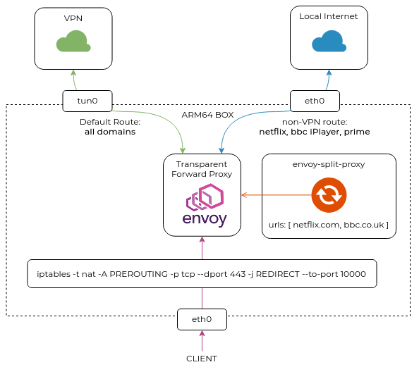

# envoy-split-proxy

Configure Envoy to act as a TCP proxy and SNI-based router to allow VPN bypass for VPN-sensitive applications like Netflix, BBC iPlayer, Amazon Prime etc. The assumption is that the host OS has multiple default routes and you want to steer _some_ traffic to a non-preferred default interface (the one that has higher metric). The current application will parse a [YAML file](./test.yaml) containing that non-default interface and a list of URLs and will configure Envoy to do SNI-based routing of these domains to that interface:



The `envoy-split-proxy` process continues to run as an agent, monitoring all changes to the supplied configuration file and synchronizing the state with the Envoy proxy.

## Quickstart

On your client device, redirect all traffic to the box that will be running Envoy:

```
ip route add default via <IP_OF_ARM_BOX> metric 10
```

On the ARM box set up an iptables redirect to send all HTTPS traffic to envoy:

```
sudo iptables -t nat -A PREROUTING -p tcp --dport 443 -j REDIRECT --to-port 10000
```

Copy `envoy.yaml` and `test.yaml` into your `pwd` and run:

```
docker run --name envoy -d --net=host -v $(pwd)/envoy.yaml:/etc/envoy/envoy.yaml envoyproxy/envoy:v1.16.2 --config-path /etc/envoy/envoy.yaml

docker run --name app -d --net=host -v $(pwd)/test.yaml:/test.yaml networkop/envoy-split-proxy -conf /test.yaml
```

All traffic is now (L7-)transparently proxied by Envoy and all domains specified in `test.yaml` are redirected to the interface specificed.


## Discovering domain names

In order to succesfully re-route a certain application's traffic, we need to know all the domain name it uses (or at least the ones that it uses for location discovery). This will most likely _not_ be a standard domain like `netflix.com` or `bbc.co.uk`. One approach is to load the app in your browser and watch the network traffic in a developer console. Another approach I found is using [netify.ai](netify.ai/resources/applications) website. For example if I wanted to find all domains for Amazon Video (Prime), I would do:

```
$ curl -sL netify.ai/resources/applications/amazon-video | grep ">Domains<" -A12
    <h3 class="feature-title">Domains</h3>
    <ul class="default-ul indent-2">
                    <li>aiv-cdn.net</li>
                    <li>aiv-cdn.net.c.footprint.net</li>
                    <li>aiv-delivery.net</li>
                    <li>amazonvideo.com</li>
                    <li>atv-ext.amazon.com</li>
                    <li>atv-ps.amazon.com</li>
                    <li>d25xi40x97liuc.cloudfront.net</li>
                    <li>dmqdd6hw24ucf.cloudfront.net</li>
                    <li>media-amazon.com</li>
                    <li>primevideo.com</li>
            </ul>
```
I would than add these domains to the list of URLs one by one or, if I'm lazy, just add all of them. It's very unlikely that such indiscriminate approach is going to break anything.


## Troubleshooting

To check to current list of bypassed domain names from a host running envoy do:

```
curl localhost:19000/    | jq '.configs[2].dynamic_listeners[0].active_state.listener.filter_chains[0].filter_chain_match.server_names'
```

To see the list of DNS lookups going out of a VPN interface do:

```
sudo tcpdump -i wg-pia udp port 53
```

To see the list of non-bypassed TCP connections do: 

```
sudo tcpdump -i wg-pia  "tcp[tcpflags] & tcp-syn != 0"
```