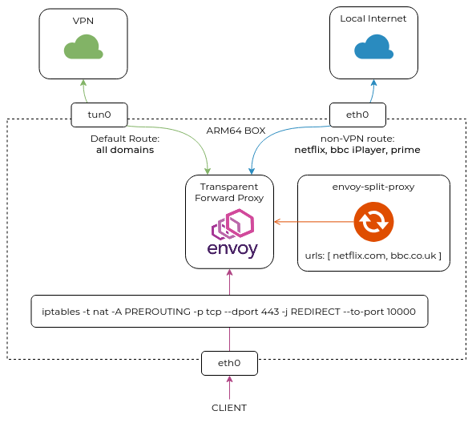

# envoy-split-proxy

Configure Envoy to act as a TCP proxy and SNI-based router to allow VPN bypass for VPN-sensitive applications like Netflix, BBC iPlayer, Amazon Prime etc. The assumption is that the host OS has multiple default routes and you want to steer _some_ traffic to a non-preferred default interface (the one that has higher metric). The current application will parse a [YAML file](./split.yaml) containing that non-default interface and a list of URLs and will configure Envoy to do SNI-based routing of these domains to that interface:



The `envoy-split-proxy` process continues to run as an agent, monitoring all changes to the supplied configuration file and synchronizing the state with the Envoy proxy.

## Quickstart

On your client device, redirect all traffic to the box that will be running Envoy:

```
ip route add default via <IP_OF_ARM_BOX> metric 10
```

On the box, traffic reaching it has to be redirected to Envoy's listeners. Pass
`-iptables` and `envoy-split-proxy` manages those rules itself, keeping them in
step with `-https-port`/`-http-port` and removing them again on shutdown -- a
stopped proxy otherwise leaves `PREROUTING` pointing at a closed port and
black-holes web traffic for every client behind the box. It needs
`CAP_NET_ADMIN`.

To do it by hand instead, omit `-iptables` and add:

```
sudo iptables -t nat -A PREROUTING -p tcp --dport 443 -j REDIRECT --to-port 10000
sudo iptables -t nat -A PREROUTING -p tcp --dport 80 -j REDIRECT --to-port 10001
```

Copy `envoy.yaml` and `split.yaml` into your `pwd` and run:

```
docker run --name envoy -d --net=host -v $(pwd)/envoy.yaml:/etc/envoy/envoy.yaml envoyproxy/envoy:v1.16.2 --config-path /etc/envoy/envoy.yaml

docker run --name app -d --net=host --cap-add=NET_ADMIN -v $(pwd)/split.yaml:/split.yaml ghcr.io/networkop/envoy-split-proxy -conf /split.yaml -iptables
```

Or just use [run.sh](./run.sh), which starts both with the right capabilities.

All traffic is now (L7-)transparently proxied by Envoy and all domains specified in `split.yaml` are redirected to the interface specificed.


## Host routing prerequisite

Envoy binds bypassed upstream sockets to the bypass interface's address.
**That only sets the source IP -- it does not choose a route.** Something has to
tell the kernel what to do with those packets, or the bypass silently does
nothing.

Pass `-ip-rule` and `envoy-split-proxy` manages it, installing the equivalent of

```
ip route replace default via <LAN_GATEWAY> dev eth0 table 200
ip rule add from <BYPASS_IP> lookup 200 priority 150
```

on startup and removing them on shutdown. The gateway comes from the main
table's default route via the bypass interface, so it follows DHCP; the rule is
reinstalled if the interface's address changes. Requires `CAP_NET_ADMIN`.
`-rule-table` and `-rule-priority` override the defaults.

Priority 150 is load-bearing: below any `lookup main suppress_prefixlength 0`
rule so LAN destinations still resolve from the main table, and above a VPN's
catch-all so bypassed traffic beats the tunnel.

`-bypass-mark <n>` additionally tags the sockets with `SO_MARK`, letting the
rule match on the mark instead:

```
ip rule add fwmark 0x51821 lookup 200 priority 150
```

That is narrower -- only Envoy's bypass sockets carry the mark, whereas any
process binding that source address matches the first form.

It is off by default because Envoy **aborts the connection** when a socket
option cannot be applied, so on a host that refuses `SO_MARK` it breaks every
bypassed connection rather than degrading.

`CAP_NET_ADMIN` goes on the **envoy** container -- Envoy sets the option on its
own sockets; the control plane only describes it.

**Known not to work on Synology DSM.** Observed there: the container runs as
uid 0, `CapEff` contains `CAP_NET_ADMIN` (bit 12), the network namespace is the
host's, no user namespace is in use, and `--privileged` is set -- and
`setsockopt(SOL_SOCKET, SO_MARK)` still returns `EPERM`, while the same mark
works from the host shell. Cause unidentified. Use `-bypass-mark 0` and steer by
source address.

Check the host allows it before turning the mark on. Note `ping` takes the mark
in decimal, unlike `ip rule` (`0x51821` = `333857`):

```
sudo ping -c1 -m 333857 1.1.1.1
```

`EPERM` there means the kernel will not let this host set `SO_MARK` at all;
leave `-bypass-mark 0` and steer by source address.

Without that rule the bypass silently does nothing. This matters most when the
box also runs a full-tunnel VPN: the VPN's catch-all `ip rule` wins, marked
packets go down the tunnel, and the VPN's `MASQUERADE` rewrites the source to
the tunnel address. Connections succeed, Envoy logs and stats look perfectly
healthy, and the only observable symptom is that the far end sees the VPN's exit
address instead of yours.

`envoy-split-proxy` checks this itself at startup (disable with `-verify`) and
logs one of:

```
Bypass check: OK. From 172.16.0.90 -> eth0; everything else -> wg-pia
Bypass check: NO ip rule selects on 172.16.0.90. Bypassed traffic will follow ...
Bypass check: traffic from 172.16.0.90 to 1.1.1.1 egresses "wg-pia", not the ...
Bypass check: ... but so does everything else -- the split is currently a no-op
```

The check runs whether or not `-ip-rule` is set, so it covers a hand-managed
rule too. It is never fatal, and no packets are sent -- `ip route get` only asks
the kernel which route it would pick.

To check by hand, `ip route get` asks the same question -- use `from
<BYPASS_IP>` or `mark <n>` to match whichever form you installed:

```
$ ip route get 1.1.1.1 from 172.16.0.90   # bypassed -> native interface
1.1.1.1 from 172.16.0.90 via 172.16.0.1 dev eth0 table 200
$ ip route get 1.1.1.1                     # everything else -> tunnel
1.1.1.1 dev wg-pia table 51820 src 10.31.196.44
```

Note `curl --interface <BYPASS_IP>` only exercises the source-address form; it
does not set a mark, so it will appear to fail against an fwmark-only rule.

Then confirm end to end. Every Netflix OCA response carries the address the
server actually saw, which is the only signal that catches a silent leak:

```
docker logs --since 3m envoy 2>&1 | grep -o 'addr=[0-9.]*' | sort -u
```

`SO_MARK` is applied by Envoy to its own upstream sockets, so if you do enable
`-bypass-mark`, `CAP_NET_ADMIN` goes on the **envoy** container, not on this
control plane.

`SO_MARK` is applied by Envoy to its own upstream sockets, so `CAP_NET_ADMIN`
goes on the **envoy** container, not on `envoy-split-proxy` -- the latter only
serves the xDS config describing the option. See [run.sh](./run.sh). Passing
`-bypass-mark 0` disables marking and falls back to source-address rules
(`ip rule add from <BYPASS_IP> ...`), which needs no extra capability but is
broader: any process binding an outbound socket to that address escapes too.

See [docs/vpn-agent-integration.md](docs/vpn-agent-integration.md) for wiring
this into [smart-vpn-client](https://github.com/networkop/smart-vpn-client).


## Discovering domain names

In order to succesfully re-route a certain application's traffic, we need to know all the domain name it uses (or at least the ones that it uses for location discovery). This will most likely _not_ be a standard domain like `netflix.com` or `bbc.co.uk`. One approach is to load the app in your browser and watch the network traffic in a developer console. Another approach I found is using [netify.ai](netify.ai/resources/applications) website. For example if I wanted to find all domains for Amazon Video (Prime), I would do:

```
$ curl -sL netify.ai/resources/applications/amazon-video | grep ">Domains<" -A12
    <h3 class="feature-title">Domains</h3>
    <ul class="default-ul indent-2">
                    <li>aiv-cdn.net</li>
                    <li>aiv-cdn.net.c.footprint.net</li>
                    <li>aiv-delivery.net</li>
                    <li>amazonvideo.com</li>
                    <li>atv-ext.amazon.com</li>
                    <li>atv-ps.amazon.com</li>
                    <li>d25xi40x97liuc.cloudfront.net</li>
                    <li>dmqdd6hw24ucf.cloudfront.net</li>
                    <li>media-amazon.com</li>
                    <li>primevideo.com</li>
            </ul>
```
I would than add these domains to the list of URLs one by one or, if I'm lazy, just add all of them. It's very unlikely that such indiscriminate approach is going to break anything.

The most reliable approach involves taking a packet capture of a client application traffic. We only need to capture TCP SYNs to see where the traffic is going and additional can narrow down the search by specifying the source address (e.g. 192.168.0.57):  

```
sudo tcpdump -i any "hostname 192.168.0.57 && tcp[tcpflags] & tcp-syn != 0"

15:28:55.101209 IP 192.168.0.57.38342 > ec2-52-19-112-13.eu-west-1.compute.amazonaws.com.https: Flags [S], seq 1055004181, win 14600, options [mss 1460,sackOK,TS val 4294904284 ecr 0,nop,wscale 6], length 0
```

With that information we can use openssl, [step](https://github.com/smallstep/cli) or any web browser to extract domain names from the TLS certificate:

```
step certificate inspect https://ec2-52-19-112-13.eu-west-1.compute.amazonaws.com -insecure --format json | jq '.names'
[
  "*.fe.api.amazonvideo.com",
  "*.ec.api.amazonvideo.com",
  "atv-ext-eu.amazon.com",
  "api.amazonvideo.com",
  "*.api.amazonvideo.com",
  "*.eu.ec.api.amazonvideo.com",
  "atv-eu.amazon.com",
  "*.na.api.amazonvideo.com",
  "*.eu.api.amazonvideo.com"
]
```

The above can be summarised to the following two configuration lines

```
## Amazon Prime
- "*.amazonvideo.com"
- "atv-ext-eu.amazon.com"
```


## Troubleshooting

See [docs/troubleshooting.md](docs/troubleshooting.md) for a structured approach
to bypass and routing faults, including the traps that make them hard to spot.

To check to current list of bypassed domain names from a host running envoy do:

```
curl localhost:19000/config_dump | jq '.configs[2]'
```

